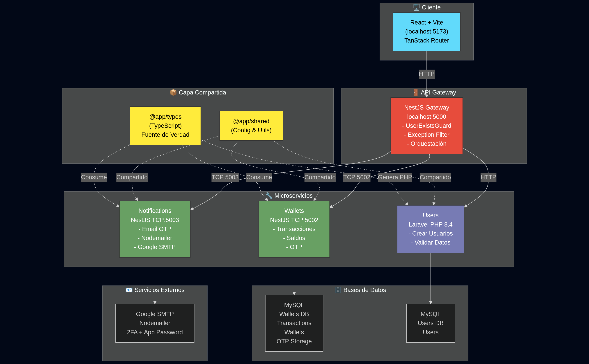
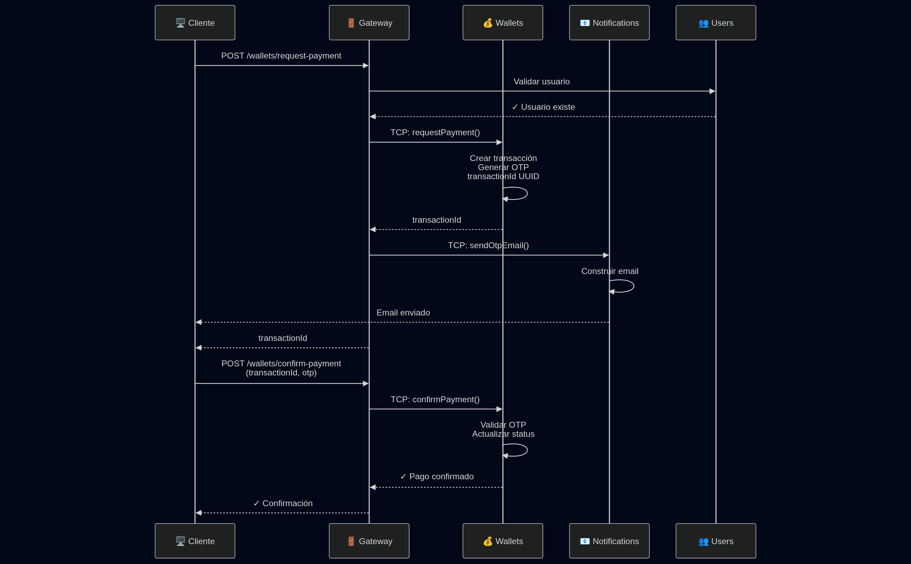
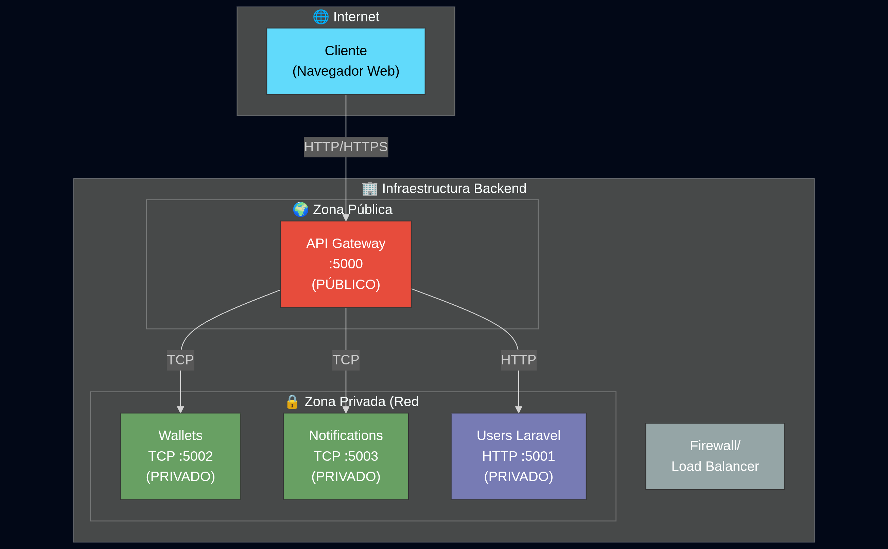

# 🏗️ Arquitectura de Microservicios - Billetera Digital - Prueba técnica

**Autor:** [Christian Carrillo Zuñiga](https://www.linkedin.com/in/christiancazu/)

## Descripción General

Este proyecto implementa una **billetera digital** utilizando una arquitectura de **microservicios** con comunicación TCP mediante NestJS. El sistema está compuesto por múltiples micro servicios independientes que trabajan juntos para gestionar usuarios, transacciones, notificaciones y billeteras digitales.

**Estructura del Proyecto:** Monorepo gestionado con **pnpm workspaces**, que permite administrar múltiples paquetes y servicios desde un único repositorio con dependencias compartidas.

## Requisitos Globales (Antes de Empezar)

Asegúrate de tener lo siguiente instalado antes de comenzar:

### 1. Node.js 22+
```bash
# Descargar e instalar desde https://nodejs.org/
node --version        # Debe ser 22 o superior
npm --version         # Incluido automáticamente
```

### 2. pnpm (Gestor de Paquetes)
**Instalar globalmente:**
```bash
npm install -g pnpm
pnpm --version        # Verificar instalación
```

**¿Por qué pnpm?** Workspace monorepo, gestión eficiente de dependencias

### 3. PHP 8.4
```bash
# macOS (Homebrew):
brew install php@8.4

# Ubuntu/Debian:
sudo apt-get install php8.4 php8.4-cli php8.4-mbstring

# Windows:
Descargar desde https://windows.php.net/

# Verificar:
php --version         # Debe ser 8.4 o superior
```

### 4. Composer (Gestor de Dependencias PHP)
```bash
# macOS:
brew install composer

# Ubuntu/Debian:
curl -sS https://getcomposer.org/installer | php
sudo mv composer.phar /usr/local/bin/composer

# Windows:
Descargar desde https://getcomposer.org/download/

# Verificar:
composer --version    # Debe estar instalado correctamente
```

### 5. MySQL 8.0+
```bash
# macOS (Homebrew):
brew install mysql

# Ubuntu/Debian:
sudo apt-get install mysql-server

# Windows:
Descargar desde https://dev.mysql.com/downloads/mysql/

# Verificar:
mysql --version       # Debe ser 8.0 o superior
# Iniciar servicio si es necesario
```

### 6. Instalar las dependencias del monorepo
```
pnpm install
``` 

### 7. Hacer build de los paquetes compartidos
```
pnpm shared build
pnpm types build
```

#### IMPORTANTE: Todos los archivos `pnpm` deben ser ejecutados desde el root del proyecto


---

## 📊 Diagrama de Arquitectura



### Flujo de Pago (Request Payment → Confirm Payment)




## 🔧 Microservicios Detallados

### 1. **API Gateway (Puerta de Entrada)**
- **Ubicación:** `apis/gateway/`
- **Tecnología:** NestJS (HTTP REST)
- **Puerto:** 5000 (localhost:5000)
- **Base de Datos:** No tiene (Solo orquesta)

**Responsabilidades:**
- ✅ Punto de entrada único para el cliente
- ✅ Validación de usuarios mediante `UserExistsGuard`
- ✅ Comunicación TCP con microservicios (Wallets, Notifications)
- ✅ Manejo global de excepciones (global-exception.filter.ts)
- ✅ Formateo de respuestas estandarizado
- ✅ Orquestación de flujos complejos

**Guardias:**
```typescript
// UserExistsGuard
- Valida que req.user.document exista en Users Service
- Se aplica a rutas que requieren usuario autenticado
- Retorna 401 si usuario no existe
```

**Manejo de Excepciones:**
```typescript
// global-exception.filter.ts
- Preserva errores de validación (422) con detalles
- Status >= 500 con typeof === 'string' → mensaje genérico
- Enruta excepciones RpcException correctamente
```

**Comandos:**
```bash
pnpm gateway dev      # Desarrollo con hot-reload
```

---

### 2. **Users Service (Gestión de Usuarios)**
- **Ubicación:** `apis/users/`
- **Tecnología:** Laravel 12 + PHP 8.4 + Composer
- **Protocolo:** HTTP REST (artisan serve)
- **Base de Datos:** MySQL

**Responsabilidades:**
- ✅ Registrar nuevos usuarios
- ✅ Validar existencia de usuarios (por documento)
- ✅ Almacenar información de 
- ✅ Mantener integridad referencial
- ✅ Generar/Implementar clases PHP desde @app/types

**Requisitos del Sistema:**
```bash
✓ PHP 8.4+
✓ Composer
✓ MySQL 8.0+
```

**Estructura del Proyecto Laravel:**
```
app/
├── Types/         # Enums generados desde TypeScript
├── Enums/         # Enums adicionales
├── DTOs/          # Extienden @app/types
├── Models/        # Extienden clases generadas (Eloquent)
├── Repositories/  # Acceso a datos
├── Services/      # Lógica de negocio
├── Controllers/   # Endpoints HTTP
├── Http/
│   ├── Requests/  # Form Requests + Validación
│   └── Resources/ # JSON Resources
└── Exceptions/    # Excepciones personalizadas
```

**Instalación y Ejecución (desde root):**
```bash
# 1. Instalar dependencias PHP/Composer
pnpm users install

# 2. IMPORTANTE: Ejecutar migraciones para crear la BD de usuarios
#    (DEBE ejecutarse ANTES de iniciar el microservicio)
pnpm users migration:run

# 3. Verificar que migraciones se ejecutaron correctamente
cd apis/users
php artisan migrate:status
cd ../..

# 4. Iniciar el microservicio Users
pnpm users dev
```

**Importante:**
- ⚠️ Ejecutar `pnpm users migration:run` ANTES de iniciar el servicio
- ⚠️ Sin ejecutar migraciones, la BD no existirá y el servicio fallará
- ⚠️ Este paso es obligatorio en la instalación inicial

**Endpoints:**
```
POST   /api/users              # Crear usuario
POST   /api/users/verify       # Verificar usuario
```

---

### 3. **Wallets Microservice (Transacciones)**
- **Ubicación:** `apis/wallets/`
- **Tecnología:** NestJS + TypeORM + MySQL
- **Protocolo:** TCP (Microservicio NestJS)
- **Puerto:** 5002 (TCP, no HTTP)
- **Base de Datos:** MySQL

**Responsabilidades:**
- ✅ Gestionar saldos de billeteras
- ✅ Crear transacciones (charge, request_payment, confirm_payment)
- ✅ Generar y validar OTP (exactamente 6 dígitos)
- ✅ Generar `transactionId` único (UUID)
- ✅ Procesar confirmación de pagos
- ✅ Actualizar estados de transacción

**Tipos de Transacciones:**
```typescript
enum TransactionType {
  CHARGE = 'charge'              // Recibir dinero
  REQUEST_PAYMENT = 'request_payment'    // Solicitar pago (genera OTP)
  CONFIRM_PAYMENT = 'confirm_payment'    // Confirmar con OTP
}
```

**Modelos TypeORM:**
```typescript
Wallet
├── id: UUID
├── userId: UUID (FK → Users)
├── balance: Decimal
└── timestamps

Transaction
├── id: UUID
├── walletId: UUID (FK → Wallet)
├── amount: Decimal
├── type: TransactionType
├── status: TransactionStatus (pending, completed, failed)
├── otp: String (6 dígitos, solo para request_payment)
└── timestamps
```

**Validaciones:**
- OTP debe ser exactamente 6 caracteres numéricos
- Amount debe convertirse a Number (no string)
- type es requerido (se incluye automáticamente)
- Lanza `RpcException` para errores de validación

**Instalación y Ejecución (desde root):**
```bash
# 1. Instalar dependencias (solo primera vez)
pnpm install

# 2. IMPORTANTE: Ejecutar migraciones para crear las tablas
#    (DEBE ejecutarse ANTES de iniciar el microservicio)
pnpm wallets migration:run

# 3. Iniciar el microservicio Wallets
pnpm wallets dev              # Desarrollo con hot-reload
```

**Importante:**
- ⚠️ Ejecutar `pnpm wallets migration:run` ANTES de iniciar el servicio
- ⚠️ Sin ejecutar migraciones, las tablas `wallets` y `transactions` no existirán
- ⚠️ Este paso es obligatorio en la instalación inicial

---

### 4. **Notifications Microservice (Email)**
- **Ubicación:** `apis/notifications/`
- **Tecnología:** NestJS + Nodemailer + Google SMTP
- **Protocolo:** TCP (Microservicio NestJS)
- **Puerto:** 5003 (TCP, no HTTP)
- **Base de Datos:** No requiere (Solo envía emails)

**Responsabilidades:**
- ✅ Enviar emails con OTP
- ✅ Notificaciones de confirmación de pago
- ✅ Logs de envíos (en consola/logs)
- ✅ Manejo de errores SMTP

**Proveedor SMTP:**
- **Proveedor:** Google (Gmail)
- **Host:** smtp.gmail.com
- **Puerto:** 587 (TLS)
- **Autenticación:** Email + App Password (16 caracteres)

**Configuración Google SMTP (Paso a Paso):**

**Paso 1: Habilitar Verificación en Dos Pasos**
```
1. Ve a: https://myaccount.google.com/security
2. Busca "Verificación en dos pasos"
3. Haz clic en "Activada"
4. Sigue el proceso (teléfono o security key)
```

**Paso 2: Generar App Password**
```
1. Ve a: https://myaccount.google.com/apppasswords
2. Selecciona:
   - App: "Correo"
   - Dispositivo: "Windows Computer" (o tu SO)
3. Google generará una contraseña de 16 caracteres
4. COPIA LA CONTRASEÑA COMPLETA (incluye los espacios)
```

**Paso 3: Guardar en `.env.local`**
```env
# Archivo: /.env.local (raíz del proyecto)
SMTP_USER=tu_email@gmail.com
SMTP_PASSWORD=xxxx xxxx xxxx xxxx
```

**Troubleshooting Email:**
```
❌ "Invalid login" 
   → Verificar que es App Password de Google (no contraseña normal)
   → Asegurar que 2FA está activo

❌ "Port 587 connection refused"
   → Revisar firewall/red
   → Asegurar conectividad a smtp.gmail.com

❌ "Email not sent / timeout"
   → Revisar logs en terminal de notificaciones
   → Verificar credenciales SMTP_USER y SMTP_PASSWORD
   → Intentar con otra cuenta de Google

✅ "Email sent successfully"
   → Si no llega, revisar carpeta Spam/Junk del destinatario
   → Google SMTP a veces marca como spam primeros intentos
```

**Comandos:**
```bash
pnpm notifications dev        # Desarrollo con hot-reload
```

## 📦 Packages - Capa Compartida

### `packages/types`
**Propósito:** Fuente de verdad para el tipado
- Enums (TransactionType, TransactionStatus)
- Interfaces (User, Wallet, Transaction)
- DTOs (CreateUserDto, ChargeWalletDto, ConfirmPaymentDto)
- Tipos compartidos entre todos los servicios

**Generación de código:**
```typescript
// Desde TypeScript se generan automáticamente:
// - Clases PHP en apis/users/app/Types/
```

### `packages/shared`
**Propósito:** Configuraciones y utilidades reutilizables
- Validadores comunes
- Configuraciones globales
- Utilitarios compartidos
- Módulos NestJS reutilizables

**Uso en NestJS:**
```typescript
import config from '@app/shared/config.json'
import type { CreateUserDto } from '@app/types'
```

## 🗄️ Estructura de Base de Datos

### Usuarios (Laravel - MySQL)
```sql
users
├── id (UUID)
├── document (string, unique)
├── name (string)
├── email (string, unique)
├── cellphone (string)
└── timestamps
```

### Wallets (NestJS - MySQL)
```sql
wallets
├── userId (UUID, FK)
├── balance (decimal)
└── timestamps

transactions
├── id (UUID)
├── walletId (UUID, FK)
├── amount (decimal)
├── type (enum: charge, request_payment, send_payment)
├── status (enum: pending, completed, failed)
├── otp (string, 6 dígitos)
└── timestamps
```

## 🔗 Comunicación entre Servicios

### TCP Pattern (NestJS Microservicios)
```typescript
// Gateway envía comando al microservicio Wallets
this.walletsClient.send<ConfirmPaymentDto>(
  { cmd: 'request_payment' },
  {
    userId: user.id,
    amount: Number(dto.amount),
    type: TransactionType.REQUEST_PAYMENT
  }
)

// Notifications recibe comando del Gateway
this.notificationsClient.send(
  { cmd: 'send_otp_email' },
  { user, transaction }
)
```

## 📋 Flujos de Negocio

### 1. Registro de Usuario
```
Client → Gateway 
       → Users API (Laravel)
         ├─ Validar datos (desde @app/types)
         ├─ Crear usuario
         └─ Retornar usuario creado
```

### 2. Solicitar Pago
```
Client → Gateway (Verificar usuario)
       → Wallets (TCP 5002)
         ├─ Crear transacción
         ├─ Generar OTP
         ├─ Guardar en BD
       → Notifications (TCP 5003)
         ├─ Enviar email con OTP (Nodemailer)
         └─ Log de envío
       → Retornar transactionId al cliente
```

### 3. Confirmar Pago
```
Client → Gateway
       → Wallets (TCP 5002)
         ├─ Buscar transacción por ID
         ├─ Validar OTP
         ├─ Actualizar status a "completed"
         ├─ Procesar pago
         └─ Actualizar balance
       → Retornar confirmación
```

## 🌐 Variables de Entorno
cambiar las variables necesarias, por ejemplo para conectar a la base de datos que se tiene en local en:

### Root `/.env.local`

## 📚 Documentación de API

**Acceder a la documentación completa en Postman:**

🔗 [Postman Workspace - Billetera Digital](https://www.postman.com/christiancazu/workspace/christian-carrillo-public/environment/40493870-43e81a16-4662-496c-85c7-9b3735d74e61?action=share&creator=40493870)

### Endpoints Principales

#### **Usuarios**
- `POST /users` - Registrar nuevo usuario
- `POST /users/verify` - Verificar usuario

#### **Wallets**
- `POST /wallets/get-balance` - Consultar saldo
- `POST /wallets/request-payment` - Solicitar pago (genera OTP)
- `POST /wallets/confirm-payment` - Confirmar pago con OTP

## Arquitectura de Despliegue




## 🚀 Instalación y Ejecución

Los siguientes pasos asumen que ya tienes todos los [Requisitos Globales](#-requisitos-globales-antes-de-empezar) instalados.

### Instalación Completa

```bash
# 1. Clonar repositorio
git clone <repo>
cd <repo>

# 2. Instalar dependencias del root (incluye todos los workspaces)
pnpm install

# 3. Ejecutar migraciones de Wallets (IMPORTANTE: crea la BD de billteras)
pnpm wallets migration:run

# 4. Ejecutar migraciones de Users (IMPORTANTE: crea la BD de usuarios)
pnpm users migration:run
# Nota: Este comando es OBLIGATORIO antes de ejecutar el microservicio Users

# 5. Iniciar todos los servicios (abre varias terminales)
# Terminal 1: Gateway
pnpm gateway dev

# Terminal 2: Wallets
pnpm wallets dev

# Terminal 3: Notifications
pnpm notifications dev

# Terminal 4: Users (Laravel)
pnpm users dev

# Terminal 5: Frontend (Cliente React)
pnpm client dev
```

### Levantar Frontend (Cliente)

**Ubicación:** `apps/client/`
**Tecnología:** React 19.2.0 + Vite + TanStack Router
**Puerto:** 5173 (localhost:5173)

**Características:**
- Hot Module Replacement (HMR)
- TanStack Router para navegación
- Tailwind CSS v4 para estilos
- Se conecta al Gateway en `localhost:5000`

**Comandos:**
```bash
# Iniciar en desarrollo
pnpm client dev              # Abre automáticamente en http://localhost:5173

# Build para producción
pnpm client build            # Genera archivos estáticos en dist/

# Preview del build de producción
pnpm client preview          # Sirve el build en http://localhost:4173
```

**Estructura del Frontend:**
```
apps/client/
├── src/
│   ├── routes/              # Rutas de TanStack Router
│   │   ├── index.tsx        # Página principal
│   │   ├── register/        # Registro de usuario
│   │   ├── balance/         # Consultar saldo
│   │   ├── request-payment/ # Solicitar pago
│   │   └── confirm-payment/ # Confirmar pago con OTP
│   ├── components/          # Componentes reutilizables
│   ├── services/            # Llamadas al API Gateway
│   └── main.tsx             # Entry point
├── index.html
└── vite.config.ts
```

**Variables de Entorno (Frontend):**
```env
# apps/client/.env.local
VITE_API_URL=http://localhost:5000
```

**Importante:**
- ⚠️ El frontend debe iniciarse DESPUÉS del Gateway (puerto 5000)
- ⚠️ Asegúrate que el Gateway esté corriendo antes de hacer peticiones
- ⚠️ En producción, configurar `VITE_API_URL` con la URL pública del Gateway

**Rutas Disponibles:**
- `/` - Página principal
- `/register` - Registro de usuarios
- `/balance` - Consultar saldo de billetera
- `/request-payment` - Solicitar pago (genera OTP)
- `/confirm-payment` - Confirmar pago con OTP

## 📦 Stack Tecnológico

| Componente | Tecnología | Versión |
|-----------|-----------|---------|
| **Frontend** | React + Vite | 19.2.0 |
| **Router** | TanStack Router | 1.157.18 |
| **Gateway** | NestJS | Latest |
| **Wallets** | NestJS + TypeORM | Latest |
| **Notifications** | NestJS + Nodemailer | Latest |
| **Users** | Laravel | 12 |
| **PHP** | PHP | 8.4 |
| **Base de Datos** | MySQL | 8.0+ |
| **Validación** | class-validator | Latest |
| **Estilos** | Tailwind CSS | v4 |
| **Tipado Compartido** | TypeScript | Latest |

## 🧑‍💼 Beneficios de la Arquitectura

1. **Escalabilidad:** Cada microservicio puede escalarse independientemente
2. **Mantenibilidad:** Código separado por responsabilidad
3. **Reusabilidad:** @app/types y @app/shared centralizan lógica común
4. **Tipado Centralizado:** Una sola fuente de verdad para tipos
5. **Generación Automática:** Código PHP generado desde TypeScript
6. **Independencia Tecnológica:** Cada servicio puede usar su stack
7. **Fault Isolation:** Fallos en un servicio no afectan otros

## � Despliegue en Producción

### ⚠️ Importante: Exposición de Servicios

En un entorno de **producción**, la arquitectura está diseñada para que:

1. **Frontend (Cliente React + Vite):**
   - **Desarrollo:** Corre en puerto 5173 con Vite dev server
   - **Producción:** Se genera build estático (`pnpm client build`) y se sirve desde CDN o servidor web (Nginx, Vercel, Netlify, etc.)
   - Se conecta únicamente al API Gateway (puerto 5000)

2. **Solo el API Gateway (puerto 5000) debe estar expuesto públicamente:**
   - Es el único punto de entrada para peticiones HTTP desde el frontend
   - Todas las rutas públicas (`/users`, `/wallets`, etc.) pasan por el Gateway
   - El frontend **solo** conoce la URL del Gateway

3. **Los microservicios NO deben ser accesibles directamente:**
   - **Wallets (TCP 5002)**: Solo accesible internamente por el Gateway
   - **Notifications (TCP 5003)**: Solo accesible internamente por el Gateway
   - **Users (Laravel HTTP 5001)**: Solo accesible internamente por el Gateway

### Puertos y Servicios

**Desarrollo:**
- Frontend: `localhost:5173` (Vite dev server)
- Gateway: `localhost:5000` (HTTP REST)
- Wallets: `localhost:5002` (TCP)
- Notifications: `localhost:5003` (TCP)
- Users: `localhost:5001` (Laravel serve)

### Protocolo de Comunicación

**Frontend → Backend:**
- Frontend ↔ Gateway: **HTTP/HTTPS** (REST API)

**Backend Interno:**
- Gateway ↔ Wallets: **TCP** (NestJS Microservices)
- Gateway ↔ Notifications: **TCP** (NestJS Microservices)
- Gateway ↔ Users: **HTTP** (Laravel REST API)

**Ventajas de esta arquitectura:**
- ✅ Frontend desacoplado: puede desplegarse en CDN separada
- ✅ Mayor seguridad: microservicios aislados de internet
- ✅ Control centralizado de autenticación/autorización en Gateway
- ✅ Un solo punto de entrada para monitoreo y logging
- ✅ Facilita implementación de rate limiting y caching
- ✅ Frontend solo necesita conocer URL del Gateway

## �🐛 Troubleshooting

### Error: "El servicio no está disponible"
- Verificar que todos los microservicios estén corriendo en sus puertos
- Revisar conexión a MySQL
- Revisar logs en cada terminal

### Email no se envía (Notifications)
- Verificar credenciales SMTP en `.env.local`
- Asegurar que Google 2FA está habilitado
- Validar que App Password es correcto (16 caracteres)
- Revisar puerto SMTP (587 para TLS)

### Migraciones no funcionan
- Asegurar que `.env.local` tiene variables DB correctas
- Verificar que MySQL está corriendo en puerto 3306
- Ejecutar: `pnpm wallets migration:run`
- Ejecutar: `pnpm users migration:run`

### PHP/Composer issues (Laravel)
- Asegurar PHP 8.4+: `php --version`
- Reinstalar dependencias: `cd apis/users && composer install`
---
